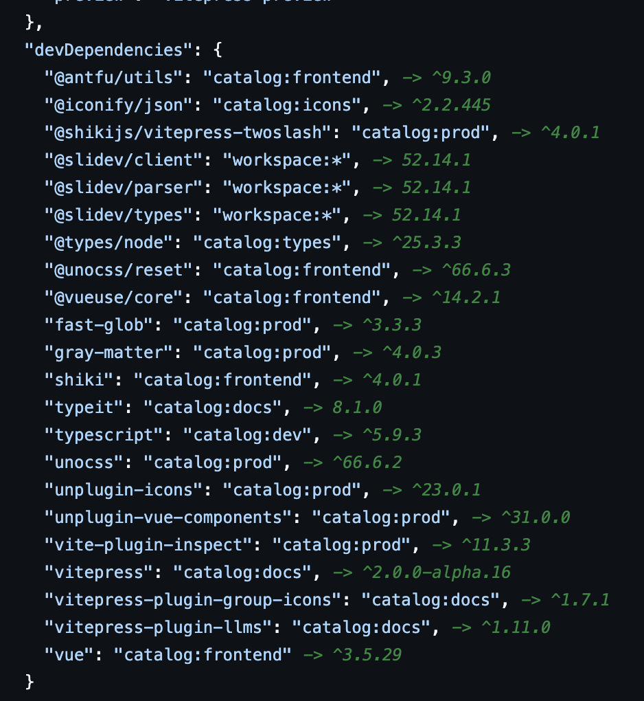

# GitHub PNPM Spec Resolver (Firefox)



Firefox WebExtension that annotates `package.json` on GitHub `/blob/` pages with resolved versions for pnpm specs:

- `workspace:*`, `workspace:^`, `workspace:~`, `workspace:<semver>`
- `catalog:<name>` and `catalog:`

## How It Works

1. Runs on `https://github.com/*/*/blob/*` pages.
2. Detects when the current blob is a `package.json` file.
3. Fetches repository files using GitHub REST API:
   - current `package.json`
   - `pnpm-workspace.yaml`
   - one recursive git tree listing for existence checks
   - candidate workspace `package.json` files inferred from package name + workspace patterns
4. Resolves dependency specs and displays inline annotations without replacing original text.
   - For `workspace:*`, it first checks path existence in the tree index, fetches existing candidates first, and only then falls back to limited brute-force probing.

## Install (temporary add-on)

1. Open Firefox and go to `about:debugging#/runtime/this-firefox`.
2. Click `Load Temporary Add-on...`.
3. Select this repository's [`manifest.json`](./manifest.json).

## Test

```bash
npm test
```

## Troubleshooting

- If you see `403` from GitHub API:
  - Ensure you're signed in to GitHub in Firefox.
  - Reload the extension from `about:debugging`.
  - Reload the GitHub page.
  - The extension limits workspace lookups to reduce rate-limit pressure.
